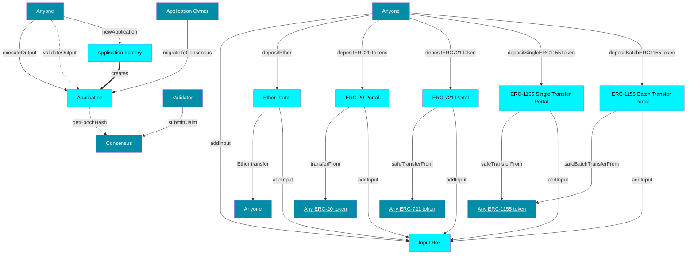

# Smart contracts (in-depth)

Cartesi Rollups is supported by several smart contracts,
each with clear responsibilities and well-defined interfaces.
The modules are depicted in the diagram below.
The yellow boxes correspond to the core contracts,
and the blue boxes correspond to externally-owned accounts (EOAs) and other contracts.



### Input Box

This module is the one responsible for receiving inputs from users that want to interact with applications. For each application, the module keeps an append-only list of hashes. Each hash is derived from the input and some metadata, such as the input sender, and the block timestamp. All the data needed to reconstruct a hash is available forever on-chain. As a result, one does not need to trust data providers in order to sync the off-chain machine with the latest input. Note that this module is completely permissionless, and we leave the off-chain machine to judge whether an input is valid or not.

### Application

An `Application` contract, just like any other contract on Ethereum, has a unique address. With this address, an application can hold ownership over digital assets on the base layer like Ether, ERC-20 tokens, and NFTs. In the next sections, we'll explain how applications are able to receive assets through portals, and perform arbitrary message calls, such as asset transfers, through vouchers.

Since there is no access control to execute a voucher, the caller must also provide a proof that such voucher was generated by the off-chain machine. This proof is checked on-chain against a claim, that is provided by the application's consensus. Therefore, an application must trust its consensus to only provide valid claims. However, if the consensus goes inactive or rogue, the application owner can migrate to a new consensus. In summary, application users must trust the application owner to choose a trustworthy consensus.

### Application Factory

The Application Factory allows anyone to deploy `Application` contracts with a simple function call. It provides greater convenience to the deployer, and security to users and validators, as they know the bytecode could not have been altered maliciously.

### Portals

Portals, as the name suggests, are used to safely teleport assets from the base layer to the execution layer. It works in the following way. First, for some types of assets, the user has to allow the portal to deduct the asset(s) from their account. Second, the user tells the portal to transfer the asset(s) from their account to some application's account. The portal then adds an input to the application's input box to inform the machine of the transfer that just took place in the base layer. Finally, the off-chain machine is made aware of the transfer through the input sent by the portal. Note that the machine must know the address of the portal beforehand in order to validate such input.

The application developer can choose to do whatever they want with this information. For example, they might choose to create a wallet for each user in the execution layer, where assets can be managed at a much lower cost through inputs that are understood by the Linux logic. In this sense, one could think of the application contract as a wallet, owned by the off-chain machine. Anyone can deposit assets there but only the application—through vouchers—can decide on withdrawals.

The withdrawal process is quite simple from the user's perspective. Typically, the user would first send an input to the application requesting the withdrawal, which would then get processed and interpreted off-chain. If all goes well, the machine should generate a voucher that, once executed, transfers the asset(s) to the rightful recipient.

Currently, we support the following types of assets:

- [Ether](https://ethereum.org/en/eth/) (ETH)
- [ERC-20](https://ethereum.org/en/developers/docs/standards/tokens/erc-20/) (Fungible tokens)
- [ERC-721](https://ethereum.org/en/developers/docs/standards/tokens/erc-721/) (Non-fungible tokens)
- [ERC-1155](https://ethereum.org/en/developers/docs/standards/tokens/erc-1155/) (Multi-tokens)

#### Input encodings for deposits

As explained above, in order to teleport an asset from the base layer to the execution layer, you need the corresponding portal to add an input to the application's input box, which will then be interpreted and validated by the off-chain machine. To do that, the machine will need to decode the input payload.

The input payloads for deposits are always specified as packed ABI-encoded parameters, as detailed below. In Solidity, packed ABI-encoding is denoted by `abi.encodePacked(...)` and standard ABI-encoded is denoted by `abi.encode(...)`.

| Asset | Packed ABI-encoded payload fields | Standard ABI-encoded payload fields |
| :- | :- | :- |
| Ether | <ul><li>`address sender`,</li><li>`uint256 value`,</li><li>`bytes execLayerData`</li></ul> | none |
| ERC-20 | <ul><li>`bool success`,</li><li>`address token`,</li><li>`address sender`,</li><li>`uint256 amount`,</li><li>`bytes execLayerData`</li></ul> | none |
| ERC-721 | <ul><li>`address token`,</li><li>`address sender`,</li><li>`uint256 tokenId`,</li><li>standard ABI-encoded fields...</li></ul> | <ul><li>`bytes baseLayerData`,</li><li>`bytes execLayerData`</li></ul> |
| ERC-1155 (single) | <ul><li>`address token`,</li><li>`address sender`,</li><li>`uint256 tokenId`,</li><li>`uint256 value`,</li><li>standard ABI-encoded fields...</li></ul> | <ul><li>`bytes baseLayerData`,</li><li>`bytes execLayerData`</li></ul> |
| ERC-1155 (batch) | <ul><li>`address token`,</li><li>`address sender`,</li><li>standard ABI-encoded fields...</li></ul> | <ul><li>`uint256[] tokenIds`,</li><li>`uint256[] values`,</li><li>`bytes baseLayerData`,</li><li>`bytes execLayerData`</li></ul> |

As an example, the deposit of 100 Wei (of Ether) sent by address `0xf39fd6e51aad88f6f4ce6ab8827279cfffb92266` with data `0xabcd` would result in the following input payload:

```
0xf39fd6e51aad88f6f4ce6ab8827279cfffb922660000000000000000000000000000000000000000000000000000000000000064abcd
```

### Vouchers

Vouchers allow applications in the execution layer to interact with contracts in the base layer through message calls. They are emitted by the off-chain machine, and can be executed by anyone in the base layer. Each voucher is composed of a destination address, a value, and a payload. In the case of vouchers destined to Solidity contracts, the payload generally encodes a function call. Moreover, the value field denotes the amount of Wei to be passed along the message call to the destination, which can be used for Ether withdrawals and for payable function calls.

A voucher can only be executed once the application's consensus accepts a claim containing it. They can be executed in any order. Although the application contract is indifferent to the content of the voucher being executed, it enforces some sanity checks before allowing its execution. First, it checks whether the voucher has been successfully executed already. Second, it ensures that the voucher has been emitted by the off-chain machine, by requiring a validity proof.

Because of their generality, vouchers can be used in a wide range of applications: from withdrawing funds to providing liquidity in DeFi protocols. Typically, applications use vouchers to withdraw assets. Below, we show how vouchers can be used to withdraw several types of assets. You can find more information about a particular function by clicking on the :page_facing_up: emoji near it.

| Asset | Destination | Value | Payload |
| :- | :- | :- | :- |
| Ether | Recipient | Transfer amount (in Wei) | (empty) |

| Asset | Destination | Function signature |
| :- | :- | :- |
| ERC-20 | Token contract | `transfer(address,uint256)` [:page_facing_up:](https://eips.ethereum.org/EIPS/eip-20#methods) |
| ERC-20 | Token contract | `transferFrom(address,address,uint256)` [:page_facing_up:](https://eips.ethereum.org/EIPS/eip-20#methods) [^1] |
| ERC-721 | Token contract | `safeTransferFrom(address,address,uint256)` [:page_facing_up:](https://eips.ethereum.org/EIPS/eip-721#specification) |
| ERC-721 | Token contract | `safeTransferFrom(address,address,uint256,bytes)` [:page_facing_up:](https://eips.ethereum.org/EIPS/eip-721#specification) [^2] |
| ERC-1155 | Token contract | `safeTransferFrom(address,address,uint256,uint256,data)` [:page_facing_up:](https://eips.ethereum.org/EIPS/eip-1155#specification) |
| ERC-1155 | Token contract | `safeBatchTransferFrom(address,address,uint256[],uint256[],data)` [:page_facing_up:](https://eips.ethereum.org/EIPS/eip-1155#specification) [^3] |

Please note that, for Solidity function calls, the voucher payload should be encoded according to the [Solidity ABI specification for calling contract functions](https://docs.soliditylang.org/en/v0.8.23/abi-spec.html). As such, it should start with the first four bytes of the Keccak-256 hash of the function signature string (as given in the table above), followed by the ABI-encoded arguments.

As an example, the voucher for a simple direct ERC-20 transfer to address `0xf39fd6e51aad88f6f4ce6ab8827279cfffb92266` with amount 100 should specify the following payload:

```
0xa9059cbb000000000000000000000000f39fd6e51aad88f6f4ce6ab8827279cfffb922660000000000000000000000000000000000000000000000000000000000000064
```

[^1]: If the application owns the tokens, prefer to use `transfer(address,uint256)`
[^2]: If no data is being passed as an argument, prefer to use `safeTransferFrom(address,address,uint256)`
[^3]: If only one token is being transferred, prefer to use `safeTransferFrom(address,address,uint256,uint256,data)`

### Notices

Notices are informational statements that can be proved by contracts in the base layer. They're emitted by the off-chain machine and contain a payload, in bytes. Application developers are free to explore different use cases for notices, their generality and negligible cost of emission makes them a powerful tool to assist integration between applications and contracts, or even other applications. Similar to vouchers, notices can only be proved once they've been finalized on-chain and if they're accompanied by a validity proof. A chess application could, for example, emit a notice informing the underlying blockchain of the winner of a tournament. While that information is not necessarily "actionable", it could be used by other applications for different purposes.

### Consensus

This module is responsible for providing valid claims to applications after reaching some form of consensus. Each application has its own mapping of claims, each of which is mapped by the range of input indices of an epoch.

The module's interface aims to be as generic as possible to accommodate any consensus model, since there are plenty to choose from. The types of consensus currently implemented include:
- Authority: managed by a single address, who has complete power over the consensus. It is trivial to implement, yet quite vulnerable.
- Quorum: managed by a generally small, finite set of validators. Consensus is reached when the majority of the quorum agrees on any given claim.

### Dispute Resolution

Disputes occur when two validators claim different state updates to the same epoch. Because of the deterministic nature of our virtual machine and the fact that the inputs that constitute an epoch are agreed upon beforehand, conflicting claims imply dishonest behavior. When a conflict occurs, the module that mediates the interactions between both validators is the dispute resolution.

The code for rollups dispute resolution is not being published yet, but a big part of it is available on the Cartesi Rollups SDK, using the [Arbitration dlib](https://github.com/cartesi/arbitration-dlib/)


