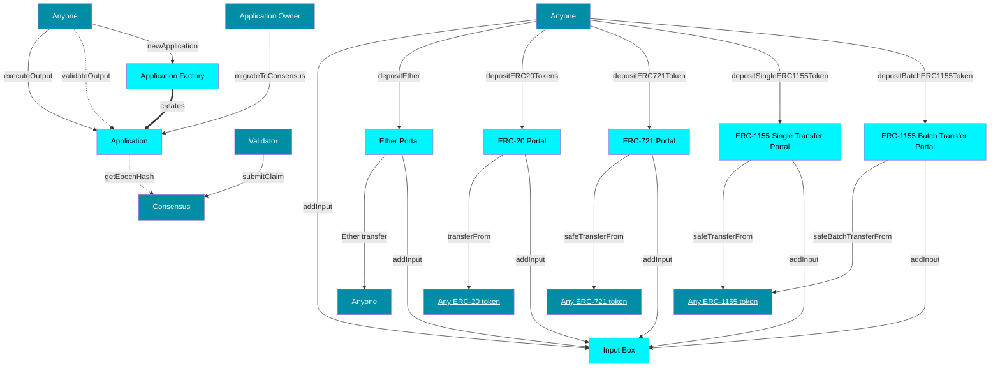

# Smart contracts (in-depth)

Cartesi Rollups is supported by several smart contracts,
each with clear responsibilities and well-defined interfaces.
The modules are depicted in the diagram below.
The light blue boxes represent to the core contracts,
while the dark blue boxes represent EOAs and external contracts.

### Input Box

This module is the one responsible for receiving inputs from users that want to interact with applications.
For each application, the module keeps an append-only list of hashes.
Each hash is derived from the input and some metadata, such as the input sender, and the block timestamp.
All the data needed to reconstruct a hash is available forever on-chain.
As a result, one does not need to trust data providers in order to sync the off-chain machine with the latest input.
Note that this module is completely permissionless, and we leave the off-chain machine to judge whether an input is valid or not.

### Application

An `Application` contract, just like any other contract on Ethereum, has a unique address.
With this address, an application can own digital assets such as Ether, ERC-20 tokens, and NFTs.
In upcoming sections, we'll explain how applications are able to manage such assets.

### Application Factory

The Application Factory allows anyone to deploy `Application` contracts with a simple function call.
It provides greater security to users, as they know the bytecode could not have been altered.

### Portals

Portals, as the name suggests, are used to safely teleport assets from the base layer to the execution layer.
It works in the following way.
First, for some types of assets, the user has to allow the portal to deduct the asset(s) from their account.
Second, the user tells the portal to transfer the asset(s) from their account to the application contract.
The portal then adds an input to the application's input box to inform the machine of the transfer that just took place in the base layer.
Finally, the off-chain machine is made aware of the transfer through the input sent by the portal.
Note that the machine must know the address of the portal beforehand in order to validate such input.

The application developer can do whatever they want with this information.
For example, they might choose to create a wallet for each user in the execution layer.
There, assets can be managed by users through inputs.
In this sense, one could think of the application contract as a wallet, owned by the off-chain machine.
Anyone can deposit assets there but only the application—through vouchers—can decide on withdrawals.

The withdrawal process is quite simple from the user's perspective.
Typically, the user would first send an input to the application requesting a withdrawal.
This input would then get processed and interpreted by the machine off-chain.
If all goes well, the machine should generate a voucher that, once executed, transfers the asset(s) to the rightful recipient.

Currently, the following types of assets are supported:

- [Ether](https://ethereum.org/en/eth/) (ETH)
- [ERC-20](https://ethereum.org/en/developers/docs/standards/tokens/erc-20/) (Fungible tokens)
- [ERC-721](https://ethereum.org/en/developers/docs/standards/tokens/erc-721/) (Non-fungible tokens)
- [ERC-1155](https://ethereum.org/en/developers/docs/standards/tokens/erc-1155/) (Multi-tokens)

#### Input encoding of deposits

As explained in the previous section, deposits are handled by smart contracts called portals.
Besides transferring assets, these contracts also report such transfers to application back-ends through inputs.

Inputs are encoded with Solidity ABI encoding,
using a mix of [strict](https://docs.soliditylang.org/en/v0.8.25/abi-spec.html#strict-encoding-mode)
and [non-standard packed](https://docs.soliditylang.org/en/v0.8.25/abi-spec.html#non-standard-packed-mode) modes.
In Solidity, strict encoding is performed using `abi.encode`,
while non-standard packed encoding uses `abi.encodePacked`.
Decoding data that was encoded using strict mode is trivial,
and many Ethereum libraries offer this feature out-of-the-box.
Decoding data that was encoded in non-standard packed mode, however,
is not an operation well-supported by libraries in general,
because the encoding can be ambiguous for some schemas.
For this reason, applications might need to perform ad-hoc decoding.

Input encoding performed by portals is specified by the [`InputEncoding`](https://github.com/cartesi/rollups-contracts/blob/main/contracts/common/InputEncoding.sol) Solidity library.

### Vouchers

Vouchers allow applications in the execution layer to interact with contracts in the base layer through message calls.
They are emitted by the off-chain machine, and can be executed by anyone in the base layer.
Each voucher is composed of a destination address, a value, and a payload.
In the case of vouchers destined to Solidity contracts, the payload generally encodes a function call.
Moreover, the value field denotes the amount of Wei to be passed along the message call to the destination.
This field can be used for Ether withdrawals and payable function calls.

A voucher can only be executed once the application's consensus accepts a claim that proves it.
No particular order is imposed on the execution of vouchers.
Although the application contract is indifferent to the contents of the vouchers, it enforces some safety checks.
First, it makes sure the voucher hasn't been successfully executed yet.
Second, it ensures that the voucher has been emitted by the off-chain machine by checking the provided proof if valid.

Because of their generality, vouchers can be used in a wide range of applications.
Below, we show how vouchers can be used to withdraw several types of assets.

| Asset | Destination | Value | Payload |
| :- | :- | :- | :- |
| Ether | Recipient | Transfer amount (in Wei) | `0x` |
| ERC-20 | Token contract | 0 | `transfer(address,uint256)` |
| ERC-721 | Token contract | 0 | `safeTransferFrom(address,address,uint256)` |
| ERC-1155 (1 type) | Token contract | 0 | `safeTransferFrom(address,address,uint256,uint256,data)` |
| ERC-1155 (2+ types) | Token contract | 0 | `safeBatchTransferFrom(address,address,uint256[],uint256[],data)` |

### Notices

Notices are informational statements that can be proved on the base layer.
They're emitted by the off-chain machine and contain a payload, in bytes.
Application developers are free to explore different use cases for notices.
Their generality and negligible cost of emission makes them a powerful tool for integrating with other applications.
Similar to vouchers, notices can only be proved once they have been finalized on-chain and are accompanied by a validity proof.
A chess application could, for example, emit a notice informing the underlying blockchain of the winner of a tournament.
While that information is not necessarily "actionable", it could be used by other applications for different purposes.

### Consensus

This module is responsible for providing valid claims to applications, after reaching some form of consensus.
The interface aims to be very generic, to accommodate many different consensus models.
As of now, the following models have been implemented:

- Authority: managed by a single address, which has complete power over the consensus. Simple, yet quite vulnerable.
- Quorum: managed by a generally small, finite set of validators. Consensus is reached by power of the majority.

### Dispute Resolution

Some types of consensus may employ a dispute resolution mechanism.
Disputes occur when two or more validators disagree on the state of an application after an epoch.
This situation implies in dishonest behavior for two reasons.
First, the application runs on a deterministic virtual machine, which means that, for every input, there is only one possible output.
Second, the inputs are known and agreed upon beforehand, thanks to the `InputBox` contract.
When such a situation happens, the dispute resolution mechanism employed by the consensus will trigger.
One such type of consensus is [Dave](https://github.com/cartesi/dave), which is under active development.
