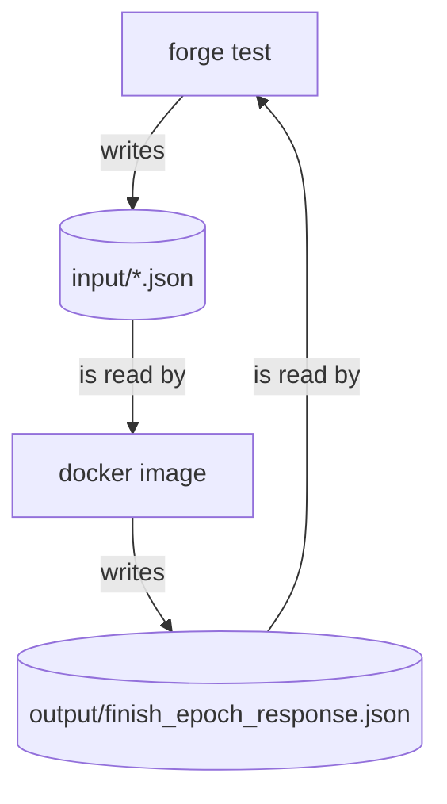

# Proof Update Helper

If one wants to execute or validate an output, they need to provide a proof.
This proof is checked on-chain by the Application contract.
In order to test the proof verification scheme, we need to generate proofs and check them with Forge.
The scripts in this folder help automate the process of updating the proofs.
If you're curious to know how the `update-proofs.sh` script works, here's a diagram of the pipeline.

